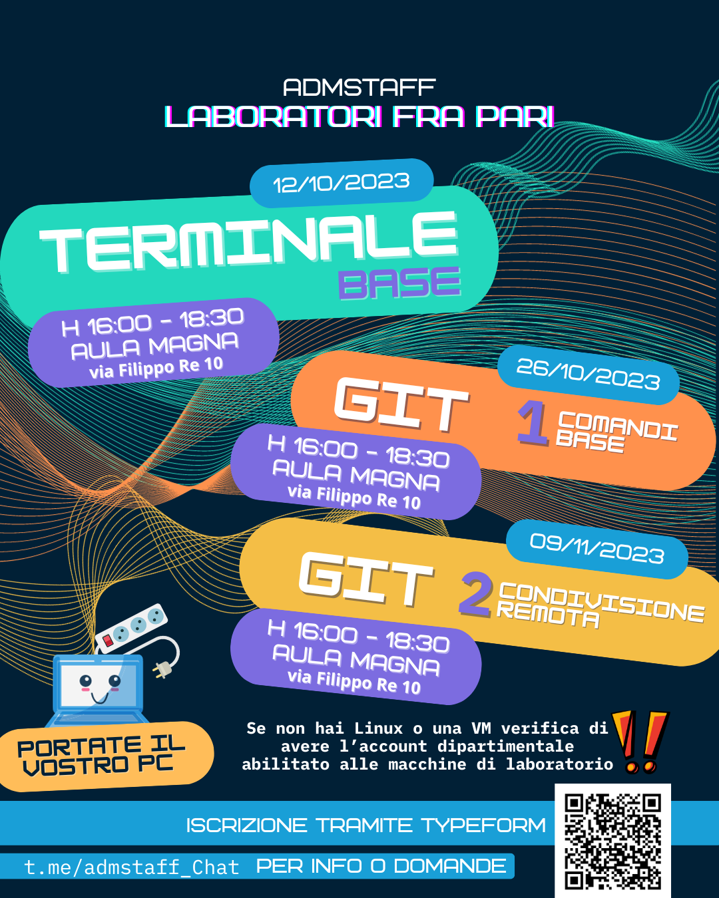

# Prossimi incontri | _Laboratori fra pari_

Anche quest'anno con grande richiesta riproponiamo laboratori su:
- **Terminale Base**: impariamo a muoverci nel terminale, manipolare file/directory, gestire i permessi...
- **Git 1 | comandi base**: impariamo a gestire i nostri progetti con Git, creare repository, fare commit...
- **Git 2 | condivisione remota**: carichiamo le nostre repository su GitHub, collaboriamo con altri utenti, gestiamo i conflitti, issue, pull request. Approfondiremo come fare su GitHub tutte le operazioni base che abbiamo imparato a fare da terminale l'incontro precedente.

Le date e luogo di svolgimento le trovate nella locandina sottostante.

_**Disclaimer**_
Questi non sono corsi universitari, sono incontri/laboratori organizzati da studenti per studenti per imparare insieme e mettere mano da subito sugli argomenti trattati.
> È quindi fondamentale **portare il proprio PC** per riuscire a seguire gli esercizi proposti.

### Iscrizione richiesta per motivi organizzativi sul [typeform 'CSUnibo in Ascolto!'](https://lr533gb3hpt.typeform.com/to/m5fzNCsW)

Per qualsiasi info o domande: [t.me/admstaff_Chat](https://t.me/admstaff_Chat)

