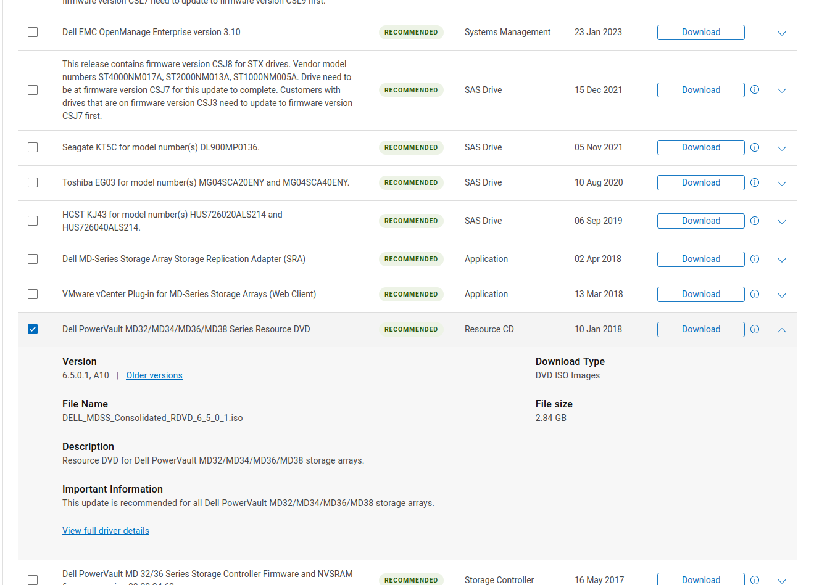

# Download del Software

Il software per il controllo dell'unità di storage è pensato per essere eseguito
su CentOS 6.3, che potete ancora torvare in giro online. Una volta installato
il sistema su una macchina nella stessa sottorete del server storage (è
consigliato usare una VM su proxmox) potete passare all'installazione del
software dal sito della DELL.

Su [questa pagina](https://www.dell.com/support/home/en-us/product-support/product/powervault-md3200i/drivers)
si trovano tutti gli aggiornamenti e strumenti per il Dell PowerVault serie MD3200.
In particolare, il software di management si trova nel cosiddetto "Resource DVD".
Questa è una foto di come risulta la pagina al momento della stesura:



Una volta scaricata l'immagine e montata sulla macchina, ad esempio con:

```
$ mount -o loop file.iso /mnt
```

potete avviare (come `root`) il programma d'installazione. Una volta completata
la procedura troverete i software installati in `/opt/dell`, in particolare il
manager in `/opt/dell/mdstoragemanager/mdstoragemanager/client`.

## Configuare un nodo per accedere allo storage

È necessario collegarsi da proxmox alla vm con sopra il programma DELL per lo storage.
Lo storage si trova nella sottorete `130.136.0.0/24`. Per accedere è quindi necessario
assegnare alla vm un ip nella stessa sottorete.

```
$ sudo ip a add 130.136.0.{random}/24 dev eth0
```

Dove **random** è un ip scelto a caso non usato da altri host (fare ping da un
pve per vedere se qualcuno risponde prima di assegnarselo). In particolare il
server storage usa il range `130.136.0.100-105`, mentre i nodi pve sono su
`130.136.0.11-15`. È anche necessario attivare l'interfaccia `eth0` con:

```
$ ip link set eth0 up
```

Per vedere se il cambio di ip funziona basta pingare lo storage `$ ping 130.136.0.100`.

Per avviare il software DELL è necessario essere root e dare il comando

```
$ /opt/dell/mdstoragemanager/mdstoragemanager/client/SMclient
```

Controllare che il server storage sul software DELL abbia ip `130.136.0.100`; se
così non fosse eliminarlo e aggiungerlo nuovamente. Per farlo andare in
**Edit > Add storage array** e usare gli ip:

```
130.136.0.100
130.136.0.101
```

Lo status del server sarà **Attention needed**, che va bene. Indica un errore
sulla batteria.
È necessario ora entrare in ssh sul nodo pve che si vuole collegare allo storage.
Bisogna aggiungere al nodo un ip nella sottorete interna, inserendo nel file
`/etc/network/interfaces` le seguenti linee:

```
iface vmbr0:0 inet static
       address 130.136.0.1{n}/24
```

Dove `{n}` è il numero del nodo (es pv4 n = 4). Per applicare i cambiamenti esegurie:

```
$ ifup -a`.
```

Sarà ora necessario installare i seguenti pacchetti:

```
$ apt install multipath-tools open-iscsi
```

Ora possiamo contattare con iSCSI una porta del server storage per avere la
lista dei dischi disponibili:

```
$ pvesm scan iscsi 130.136.0.102
```

Si noti che `130.136.0.102` è semplicemente un indirizzo dello storage, ma andrebbe
bene un qualsiasi altro indirizzo (tranne i due di management, il `100-101`) visto
che controllano tutti gli stessi dischi fisici.

Per dare accesso allo storage alla nuova macchina dovremo sapere qual'è il suo
identificativo, che troviamo in fondo al file:

```
$ cat /etc/iscsi/initiatorname.iscsi
```

Aggiungere sul software dell:

1. **Configure > Configure hosts access manual**.
2. Name: `pv{n}`.
3. Il codice è quello trovato con il comando `cat` sopra citato. Selezionarlo e premere "Add".
4. Selezionare "Yes, this host will share...". Sotto "Select exixting group" selezionare "proxmox".

Copiare il seguente file da un nodo in cui è già presente: (Lasciato anche di seguito)

```
$ scp 130.136.3.3:/etc/multipath.conf /etc/multipath.conf
```

In caso venisse perso, eccone una copia salvata online: [multipath file](multipath.conf).

Controllarne il contenuto. Siamo particolarmente interessati ai `wwid`, che ci
servono per segnalare a `multipath` che _non deve_ ignorare i dischi con quei wwid.
Il comportamento di defaulti di mulipath è ignorare tutti i dischi.

```
$ cat /etc/multipath.conf
```

Copiare il codice dopo il `wwid` e inserirlo al posto di `{code}` nel seguente comando
In alternativa per ottenere `{code}` puoi seguire la guida per [un nuovo disco](#configurazione-di-un-nuovo-disco).

```
$ multipath -a {code}
```

Fare un `reboot` e vedere se i dischi si vedono con

```
$ lsblk
```

E controllare se le path di ridondanza sono tutte attive (è normale che alcune siano idle):

```
$ multipath -ll
```

## Configurazione di un nuovo disco

Nel caso in futuro vengano create altri dischi virtuali (che avranno un wwid
diverso), si può ottenere il loro `wwid` con:

```
$ /lib/udev/scsi_id -g -u -d /dev/sdX
```

dove `/dev/sdX` è il percorso al device iSCSI del nuovo disco.

## Guida ufficiale proxmox

Per ulteriori informazioni, potete seguire le guide ufficiali di proxmox:

- [iSCSI](https://pve.proxmox.com/wiki/Storage:_iSCSI)
- [iSCSI+Multipath](https://pve.proxmox.com/wiki/ISCSI_Multipath)
